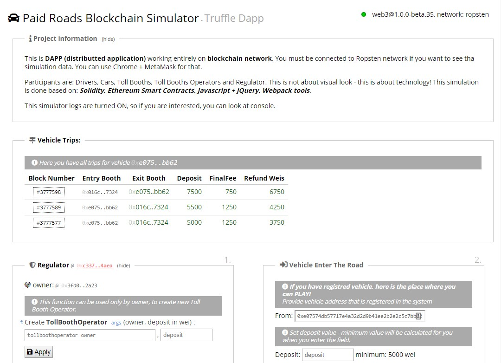

# ROAD SIMULATOR

This is private project so I'm not allow to make the code public. 

However you can see the full working blockchain DAPP here: [road-simulator](http://dzariusz.com/road-simulator)


This simulator is working entirely on blockchain network. 
You must be connected to Ropsten network to see some data pulled from blockchain. 
 You can use eg. Chrome + MetaMask.



This simulator is made with:
* Solidity Smart Contracts
* Truffle
* Web3
* pure Javascript + a little of help with jQuery
* webpack 


## Dev notes

### how to run it

```
# initialize the environment
npm install

# run development server
npm run dev

# build for production
npm run build
```


